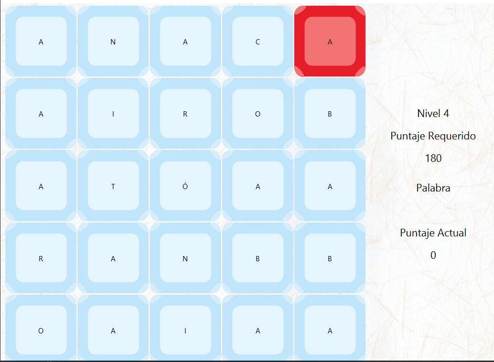

# Encuentra Palabras

Ecuentra Palabras is a game built in java 8 with JavaFx
## Objective
The objective of this game is win every level with the correct selection of the words that
are present in the window, in addition there are some red buttons that cause a decrease in points

This game is an example the incredible things that we could make in Java with Just Java 8
The Game have some concept of programming, like threads

The threads are used in movement of every button, and additionally in the timer of the red buttons.

